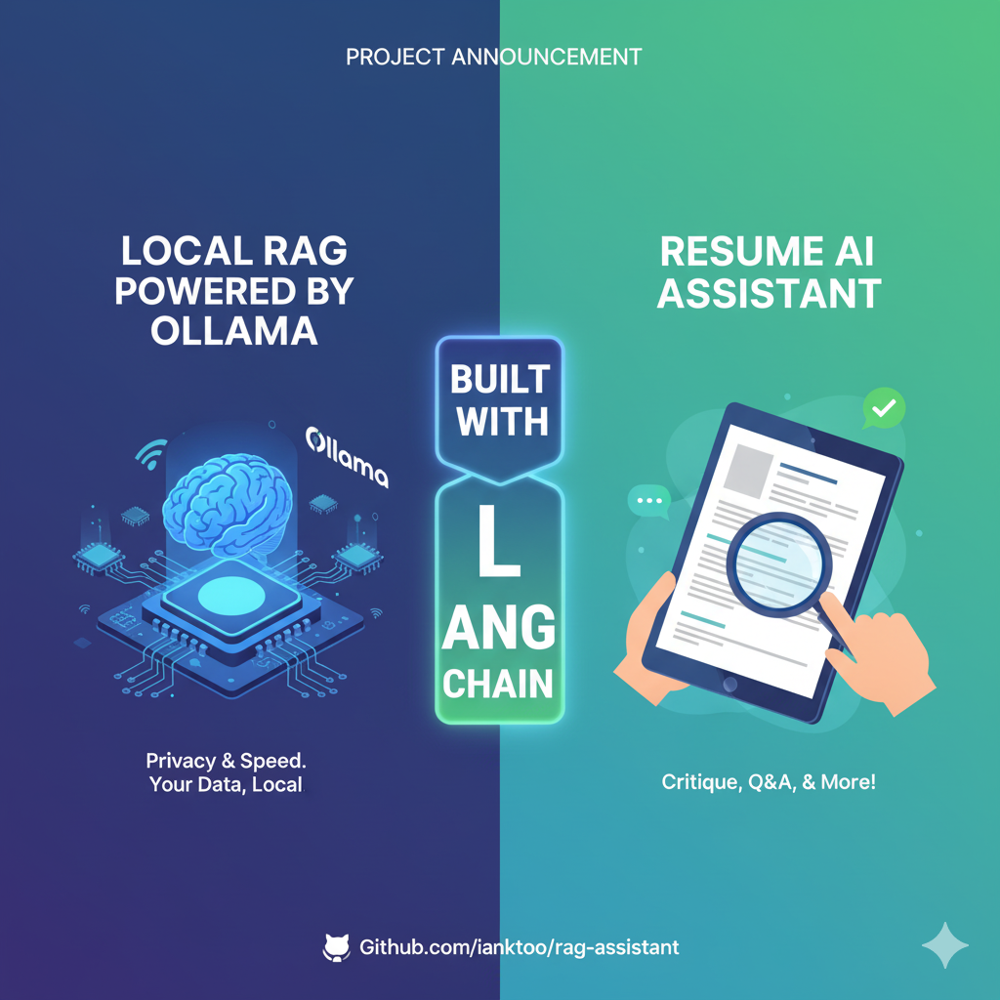

# Local RAG Resume Assistant

## 📄 Project Overview

This project is a beginner-friendly demonstration of a Retrieval-Augmented Generation (RAG) system built entirely on local, open-source technologies. The application allows a user to upload their resume `(PDF, DOCX, or TXT)`, which is then indexed into a local vector database.

The core goal is to enable **two** key functions:

- **Q&A Chat**: Ask specific questions about the resume content (e.g., "What are my start and end dates for my second job?").

- **Structured Critique**: Request a professional, structured critique of the resume, including strengths, areas for improvement, and suggested career paths.

The entire interface is delivered via *Gradio*, making it runnable via a single Python script.



## ✨ Key Features

- 100% Local Execution: Runs the Large Language Model (LLM) and embedding model locally using Ollama.

- RAG Pipeline: Uses LangChain for document loading, chunking, embedding, and retrieval.

- Vector Storage: Employs ChromaDB for efficient, persistent storage of resume embeddings.

- Robust Document Parsing: Utilizes the Unstructured library to reliably handle various resume formats (PDF, DOCX, TXT).

- Structured Output: Leverages Pydantic and LangChain to force the LLM to return a clean, actionable JSON critique.

## ⚙️ Prerequisites

You must have the following installed and running before setup:

---

### 1. Ollama

The Ollama application must be installed on your operating system (Mac, Windows, or Linux) and running in the background.

Install [Ollama](https://ollama.com/): Download from the official website

Pull Models: Open your terminal and pull the LLM and embedding models specified in `app.py`:

``` bash
ollama pull llama3 # install ollama3
ollama pull nomic-embed-text # install and embedding model
```

---

### 2. Python (3.9+)

Ensure you have a modern version of Python installed.

---

### 3. System Dependencies for Unstructured (Optional but Recommended)

If you plan to upload PDF or DOCX files, the unstructured library often requires system dependencies for file parsing (though it might work without them on some systems).

Linux/WSL (Debian/Ubuntu):

``` bash
sudo apt-get install libxml2-dev libxslt1-dev poppler-utils
```

macOS (using Homebrew):

``` bash
brew install libxml2 libxslt poppler
```

## 🚀 Setup and Installation

Clone the Repository (or create the files):

``` bash
git clone <your-repository-url>
cd local-rag-resume-assistant
```

Create and Activate a Virtual Environment:

``` bash
python -m venv venv
source venv/bin/activate  # On Linux/macOS
.\venv\Scripts\activate   # On Windows
```

Install Python Dependencies:
All required libraries are listed in `requirements.txt`.

``` bash
pip install -r requirements.txt
```

## ▶️ How to Run

- Ensure Ollama is Running: Verify the Ollama server is active in the background.

- Run the Application: With your virtual environment activated, run the main script:

``` bash
python app.py
```

Access the App: Gradio will print a local URL (e.g., http://127.0.0.1:7860). Open this link in your web browser.

## 🧑‍💻 Usage

The application is structured into three tabs:

- 📄 Upload & Index Resume: Upload your PDF/DOCX/TXT file and click "Process and Index Resume". This step performs the core RAG ingestion (chunking, embedding, and saving to chroma_db/).

- 💬 Ask Q&A: Once indexed, use the chat interface to ask specific questions based only on the content of the uploaded resume.

- ✨ Get Critique: Click "Generate Professional Critique" to trigger the advanced, structured output chain, receiving actionable feedback on your resume.

## 📁 Project Structure

``` bash

    local-rag-resume-assistant/
    ├── app.py                  # Main application script (LangChain, Gradio, Ollama logic)
    ├── requirements.txt        # List of Python dependencies
    ├── README.md               # This file
    ├── project_guide.md        # Detailed concepts and setup guide
    ├── .gitignore              # Ignores venv/, caches, and the local chroma_db/
    └── chroma_db/              # IGNORED - Local directory for vector store persistence
```

## ⚙️ Configuration
If you wish to change the local LLM or embedding model, modify the following global variables at the top of app.py. Ensure you have pulled the new models using ollama pull <model_name> first.

Python

``` bash
# app.py snippet
OLLAMA_BASE_URL = "http://localhost:11434"
LLM_MODEL = "llama3"         # Change to 'mistral' or another LLM
EMBEDDING_MODEL = "nomic-embed-text" # Change to 'all-minilm' or another embedding model
VECTOR_DB_DIR = "./chroma_db"
```